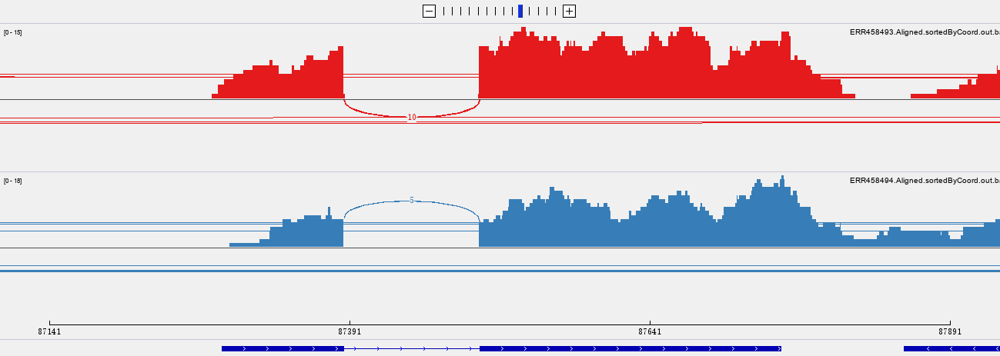
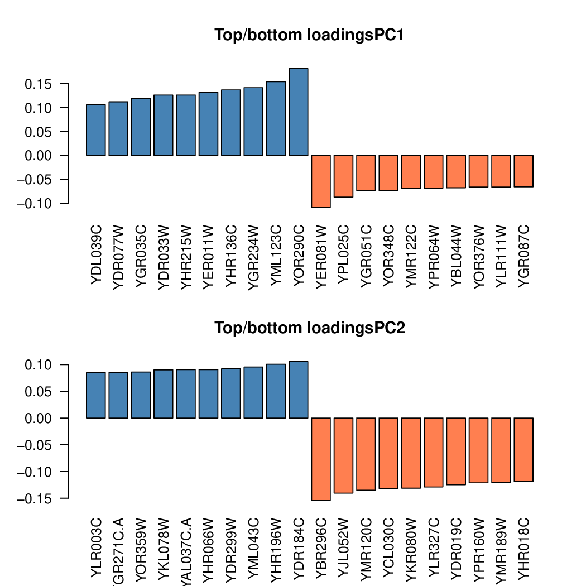

```{r setup, include=FALSE}
knitr::opts_chunk$set(echo = TRUE)
```

## Inspecting BAM files
#### 1. Download the Integrative Genomics Viewer from the Broad Institute. Download 2 BAM files from the Gierlinski data set to your computer and load them into the IGV Browser. Find a gene with at least one intron and take a Sashimi plot that you include in your html file.
(@) Download *.bam* files and their index files *.bai* for the first two samples *ERR458493* and *ERR458494* generated by STAR.  
(@) Download IGV (version 2.8.0) from the website (Windows).  
(@) Choose reference genome with *S.cerevisiae sacCer3* form the top left menu.  
(@) Use **File** --> **Load From File** to load in two BAM files above.  
(@) Zoom in and found gene **YAL030W** on the chrI has two exons and one introns.  



## Understand read counts
#### 1. Describe 2 properties of RNA-seq count data that researchers have identified. Please also describe the adjustments that need to be made to use them as more reliable proxies for gene expression evaluations.
1. Read counts cannot accurately reflect the expression of a certain genes, as many factors can affect count number such as the length of the gene, GC content etc.  
2. Will encounter issues when a read can be mapped to multiple locus.

Some factors have to be taken into account when adjust the raw read coutns:  

- Keep sequencing depth at a relative equal level.  
- Adjust the effect of GC bias since a higher GC ratio in a proper range would more likely to be sequenced.  
- Adjust the effect of length of genes as longer genes tend to have more mapped reads.  
- Adjust the influence by expression of other genes.  

#### 2. What is the main difference between exploratory analysis and the tests for differential gene expression in terms of types of questions that can be addressed with either one?
Exploratory analysis doesn't have a specific goal or type of test to implement on the data. Since there is not specific goal, there is no null hypothesis to test. It is more about discover biases and unexpected variablity.  

#### 3. Exploratory analyses of DESeq.ds objects: generate a dendrogram and a PCA plot of our 10 samples and briefly explain the major insights you can derive from them. Can you infer what the pcaExplorer plots of the "Top Loadings" represent?
First load the read counts matrix from the readCounts output, and convert it into a DESeq2 object. Preprocess the data, normalize it via `rlog()` and it is ready for further analysis.

```{r, message=F}
library(DESeq2)
library(magrittr)

readcounts <- read.table("./featCounts_Gierlinski_genes.txt", header = T)
colnames(readcounts) <- c(colnames(readcounts)[1:6], paste0("SNF2_", c(1:5)), paste0("WT_", c(1:5)))
rownames(readcounts) <- make.names(readcounts$Geneid)

readcounts <- readcounts[,-c(1:6)]
sample_info <- DataFrame(condition = c(rep("SNF2",5),rep("WT",5)), row.names = colnames(readcounts))

DESeq.ds <- DESeqDataSetFromMatrix(countData = readcounts,
                                   colData = sample_info,
                                   design = ~ condition)

DESeq.rlog <- rlog(DESeq.ds, blind = T)
```

To generate dendrogram and PCA pltos, first calculate pairwise correlation coefficient between samples via Pearson method. Then convert similarity (coefficient) into distance. For dendrogram, use `hclust` to implement clustering step and plot it. For PCA, use `plotPCA` directly.

```{r}
corr_coeff <- cor(assay(DESeq.rlog), method = "pearson")
#as.dist(1-corr_coeff, upper = T) %>% as.matrix %>% pheatmap::pheatmap(.,main = "Pearson correlation")  
as.dist(1-corr_coeff) %>% hclust %>% plot(., labels = colnames(assay(DESeq.rlog)), main = "rlog transformed read counts")

plotPCA(DESeq.rlog)
```

Use pcaExplorer to explore plots of the "Top Loadings".
```{r, message=F}
library(pcaExplorer)
#pcaExplorer(dds = DESeq.ds, dst = DESeq.rlog)
```

From the top panel, I found the tab `Samples View`, where I can view *Samples PCA*, *Scree plot for the samples PCA* and *Top/bottom loadings PCA1*. Results of top loadings is shown as below:  



The value of loading of a certain gene is the coordinate in PCA1 axis or PCA2 aixs. When ploting PCA using the first two eigenvectors as axis, the loading reflects the position of a gene. In other word, loading can be deemed as how much the count of a gene can be represented by PCA1 or PCA2. a positive number means positive correlated and a negative number means negative correlated.

## Understanding DESeq2 S4 objects.
Inspect the objects that are returned by rlog() and DESeqDataSetFromMatrix, repectively.  
```{r, message=FALSE}
DESeq.ds
DESeq.rlog
```

#### 1. Describe at least 2 similarities and 2 differences between them in regards to their content and the downstream functions you may have to use to interact with them. Feel free to use any additional documentation available, just let us know how you found each answer.  
Similarity:  

- They have the same dimension, rownames and colnames.  

Difference:  

- Classes are difference for the two, one is DESeqDataSet and the other is DESeqTransfrom.  
- DESeqDataSetFromMatrix has two additional slots that DESeqTransform doesn't have: `design` and `dispersionFunction`.  
- DESeqTransform class can be used as the input to tell certain tools like pcaExplorer to specify what kind of data to use (must be in DESeqTransform class) while DESeqDataSetFromMatrix could not. However, DESeqDataSetFromMatrix could be used to further analysis like log2 fold change and wald test to get p values to determine significant genes.  
- DESeq.ds has a matrix in `assays` named **counts** while the name of DESeq.rlog is not explicitly shown.  
- DESeq.ds has no rowData names while the other has 7.  

#### 2. How can you extract the expression values stored in either object?
For DESeq.ds and DESeq.rlog, use `assay()` when there is only one assay in `assays` section. If more than one assays, use the specific name of the values such as using `counts()` to extract expression values in DESeq.ds.  
```{r}
head(counts(DESeq.ds))
head(assay(DESeq.ds))
head(assay(DESeq.rlog))
```

#### 3. How can you add an additional matrix named "my_personal_normalization" to either object?

The matrix data of a DESeq2 object could be easily accesssed by `assay`.

```{r}
DESeq.ds <- estimateSizeFactors(DESeq.ds)
norm.counts <- counts(DESeq.ds, normalized=T)
assay(DESeq.ds, "my_personal_normalization") <- norm.counts
```


## Inspecting the source code of R functions
#### 1. Include the source code of the following DESeq2 functions in your homework's html:

- rlog()  
- estimateDispersions()  
- rlogData()  

#### For rlog:  
```{r}
rlog
```

#### For estimateDispersions:  
```{r}
findMethods("estimateDispersions")
```

#### For rlogData:  
```{r}
DESeq2:::rlogData
```

## Understanding DE analysis
#### 1. In your own words, describe how DESeq2 calculate a p-value that you can use to decide whether a given genes shows different expression values when comparing two conditions of interest. Start from what types of values are used as the measurements.
The calculation of p-value uses the unlogged sizefacotr-normalized read counts as the starting point. First calculated the mean counts of genes across all samples, and log2 fold change of mean counts by the condition SNF2 over WT. 

In `results()` we set `independentFiltering = T` and `alpha = 0.05` . The filtering step would maximize the number of genes that reject the null hypothesis, which means under the preset alpha cutoff, in this case 0.05. The p values of genes that are not selected would be set to NA. 

Utilize dispersion and size factors to calculate negative binomial GLM fitting paramter beta. Then Wald test is implemented to calculate p-value using betas, and meanwhile implemeting the filtering step.

Cook's distance would be calculated for each read counts to detect outliers, a numeric that indicate the influence of a data point to least-square regression. The p values of those higher than a default threshold of 0.99 would be set to NA.

Finally, the p-values are adjusted by using the default Benjamini–Hochberg (BH), a kind of ranking correction.

#### 2. Despite the fact that we are testing each gene individually, which calculations/values are influenced by the values of the other genes in the same matrix? Explain at least one.
Read counts during the sizefactor normalization would be influenced. 

Considering the sizefactors are determined by taking the median of ratios to the reference samples, how large a gene of a certain sample would be scaled depends on other genes.

#### 3. From the source code of nbinomWaldTest(), identify the relevant line where the Wald statistic is calculated. Explain what the objects contain that are used for the calculation.

```{}
nbinomWaldTest
```

Those related to Wald statistic:  
```{}
fit <- fitNbinomGLMs(objectNZ, betaTol = betaTol, maxit = maxit, 
            useOptim = useOptim, useQR = useQR, renameCols = renameCols, 
            modelMatrix = modelMatrix, minmu = minmu)  
betaMatrix <- fit$betaMatrix  
betaSE <- fit$betaSE  
WaldStatistic <- betaMatrix/betaSE  
WaldPvalue <- 2 * pnorm(abs(WaldStatistic), lower.tail = FALSE)  
```

Objects:  
**fit**: a structure that contains results from negative binormial GLM model fitting giving the read counts data.  
**betaMatrix**: the *beta* parameter matrix from fitting which reflects the effect of fold change.  
**betaSE**: standard errors for beta which reflect variance of fold change.  
**WaldStatistic**: calculate wald statistic from betaMatrix and betaSE.  
**WaldPvalue**: calculate p value from WaldStatistic.  